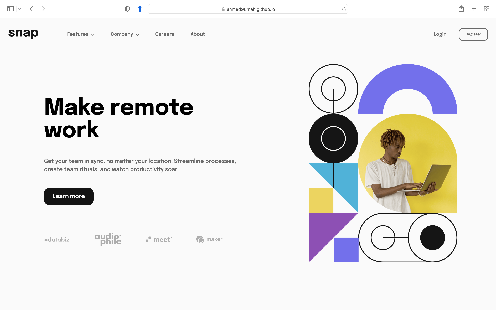
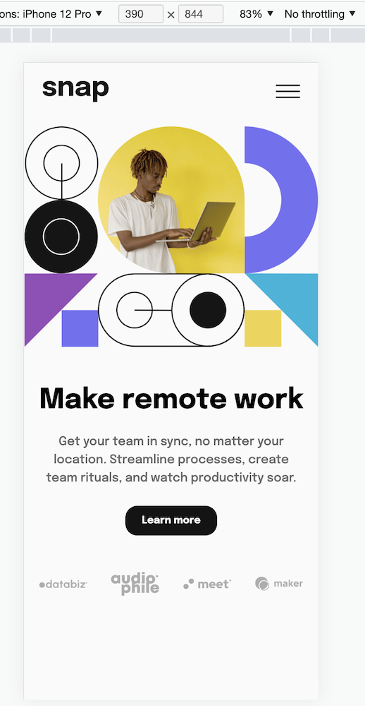

# Frontend Mentor - Intro section with dropdown navigation solution

This is a solution to the [Intro section with dropdown navigation challenge on Frontend Mentor](https://www.frontendmentor.io/challenges/intro-section-with-dropdown-navigation-ryaPetHE5). Frontend Mentor challenges help you improve your coding skills by building realistic projects.

## Table of contents

- [Overview](#overview)
  - [The challenge](#the-challenge)
  - [Screenshot](#screenshot)
  - [Links](#links)
- [My process](#my-process)
  - [Built with](#built-with)
  - [What I learned](#what-i-learned)
  - [Continued development](#continued-development)
  - [Useful resources](#useful-resources)
- [Author](#author)
- [Acknowledgments](#acknowledgments)

## Overview

### The challenge

Users should be able to:

- View the relevant dropdown menus on desktop and mobile when interacting with the navigation links
- View the optimal layout for the content depending on their device's screen size
- See hover states for all interactive elements on the page

### Screenshots

 .png)

### Links

- Live Site URL: [GitHub Hosted ".github.io"](https://ahmed96mah.github.io/F-E-Mentor-Snap-Design/)

## My process

### Built with

- Semantic HTML5 markup
- Sass
- CSS Flexbox
- CSS Grid
- Mobile-first workflow
- TypeScript for DOM minipulation

## Author

- Frontend Mentor - [@Ahmed96Mah](https://www.frontendmentor.io/profile/Ahmed96Mah)
- LinkedIn - [@Ahmed Abd Al-wahab](https://www.linkedin.com/in/ahmed-abd-al-wahab-b177a1140/)
